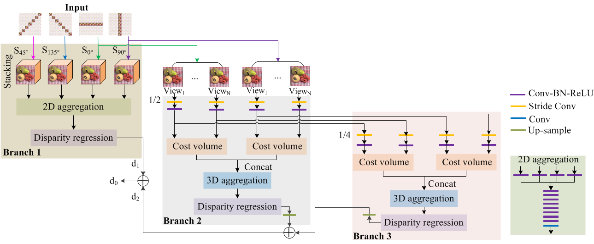
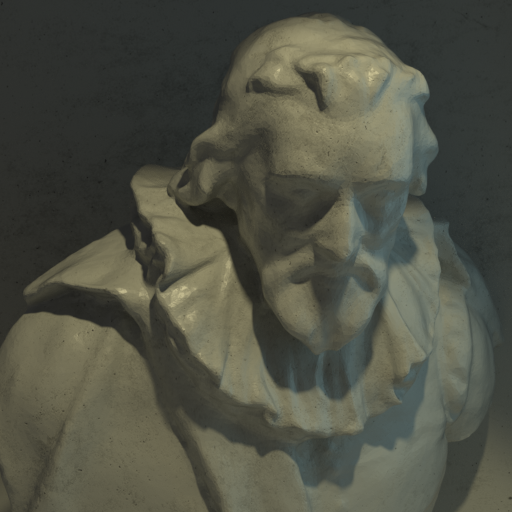
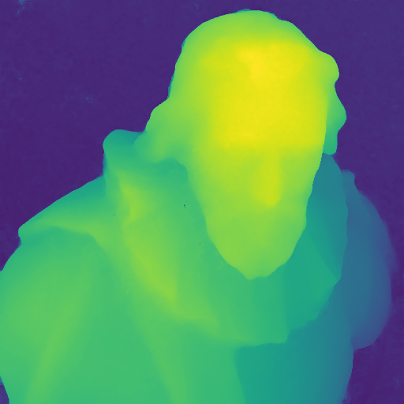

# MANet
Oral presentation ICASSP 2020 Paper - [MANet: Multi-scale Aggregated Network For Light Field Depth Estimation](https://drive.google.com/open?id=17JqhbE_gYSG9OJEqWwT1qtDQ-xNBs0zI)

**New* (2020.07.09)** We have created a large-scale wide-baseline light field dataset that you might be interested in, which is created for training the deep learning-based models for depth estimation. You might use this dataset for other purpose if possible. Please feel free to download from our new dataset from <a href="https://zenodo.org/record/3931237#.XwTVNxT7SaE">here (Part I)</a> and <a href="https://zenodo.org/record/3934712#.XwTTWRT7SaE">here (Part II)</a>

# Table of Contents
- [Architecture](#architecture)
- [Requirement](#requirements)
- [Datasets](#datasets)
- [Pretrained models](#models)
- [Inference](#inference)
- [Results](#results)
- [Citation](#reference)

# Architecture


# Requirement
```
OS system: Windows or Ubuntu
Software: Python == 3.6.7, Tensorflow == 1.12, Pillow == 5.0.0, Opencv == 3.4.5.20
Hardware: CPU or GPU (Geforce 1080ti, 11GB)
```

# Datasets
<ul style="list-style-type:circle;">
  <li>Please download the synthetic light field dataset CVIA-HCI dataset from <a href="https://lightfield-analysis.uni-konstanz.de/">here</a>.</li>
  <li>Please download the EPFL dataset from <a href="https://www.epfl.ch/labs/mmspg/downloads/epfl-light-field-image-dataset/">here</a>, which is captured by the Lytro ILLUM camera.</li>
</ul>

# Pretrained models
Please download our pretrained model from [Google drive](https://drive.google.com/open?id=1gnuVdIcnfOgGlwPev5x8u4tjiBn6cchy), which is used in our paper. You can also use it to infer plenoptic (light field) camera datasets.

# Inference
```
python infer.py --dataset YOUR_DATASET --move_path YOUR_IMAGES_MOVE_PATH
```
# Results
Our depth estimation results can be downloaded from [Google drive](https://drive.google.com/open?id=1FYeTXjpy6PGJiVvL2k2Q3bvKnRNAA0Cf). Here shows an example of the "Cotton" scene from the CVIA_HCI dataset.
|   |  |
|:---:|:---:|
| Central view | Depth map |

# Citation
If you use our code in your research, please cite our paper:
```
@inproceedings{Li2019MANet,
author={Li, Yan and Zhang, Lu and Wang, Qiong and Lafruit, Gauthier},
title={MANet: Multi-scale aggregated network for light field depth estimation},
year={2020},
booktitle={ICASSP 2020}
}
```
